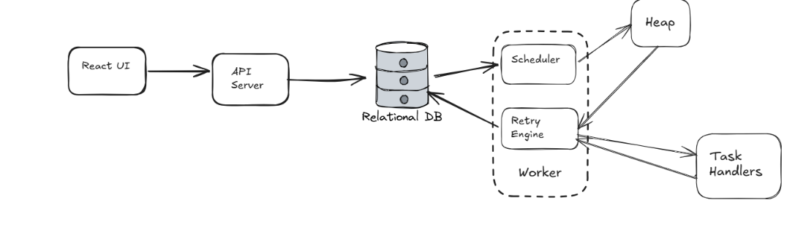

# Zubbee Scheduler

A background job scheduler with priority queuing, retries, dead-letter queue, and a live React dashboard. This was built as part of the Dilamme R&D Stage 9 challenge.

---

## What It Does

Jobs can get created, queued, processed, and tracked. Workers run independently in the background to handle failure on its own in any of the scheduled jobs. A scheduler that only works in the happy path is broken and tries a maximum of 3 times. If it remains failed after 3 tries, it is added to the dead letter queue that can be reviewed and retried again.

## Demo Video

https://github.com/user-attachments/assets/738246c3-1e5d-46fb-ba35-c35db9c802a0

## Setup

### Prerequisites

- Node.js v20+
- npm

### Install

```bash
git clone https://github.com/zub-bee/zubbee-scheduler.git
cd zubbee-scheduler
npm install
```

### Start the server

```bash
node src/index.js
node start index.js
```

### Start the worker

```bash
node src/worker.js
node start worker-start.js
```

---

## API Endpoints

### Create a job

```bash
curl -X POST http://localhost:3000/jobs \
  -H "Content-Type: application/json" \
  -d '{"type":"send_email","priority":1,"payload":{"to":"test@gmail.com","subject":"Hello"}}'
```

### Get a job

```bash
curl http://localhost:3000/jobs/1
```

### Filter by status

```bash
curl http://localhost:3000/jobs?status=failed
```

### Cancel a job

```bash
curl -X PATCH http://localhost:3000/jobs/1/cancel
```

### View dead-letter queue

```bash
curl http://localhost:3000/dlq
```

### Manually retry a DLQ job

```bash
curl -X POST http://localhost:3000/dlq/1/retry
```

## Architecture Diagram



## Data Flow

```plaintext
┌─────────────────────────────────────────────────────────────┐
│                        React UI (Vite)                      │
│  Dashboard · Jobs Table · Playground · DLQ · Stats         │
└───────────────────────────┬─────────────────────────────────┘
                            │ HTTP (polling every 3s)
┌───────────────────────────▼─────────────────────────────────┐
│                   Express API Server (:3000)                 │
│  POST /jobs   GET /jobs   PATCH /jobs/:id/cancel            │
│  GET /jobs/counts   GET /dlq   POST /dlq/:id/retry          │
│  GET /api-docs  (Swagger UI)                                │
└───────────────────────────┬─────────────────────────────────┘
                            │ better-sqlite3 (WAL mode)
┌───────────────────────────▼─────────────────────────────────┐
│                   SQLite Database (database.db)              │
│  jobs · attempts · job_dependencies · dlq                   │
└───────────────────────────┬─────────────────────────────────┘
                            │ reads/writes
┌───────────────────────────▼─────────────────────────────────┐
│                        Worker Process                        │
│  Heap scheduler · TimingWheel scheduler · DAG gate          │
│  Retry/backoff · DLQ insertion · Recurring job re-queue     │
└─────────────────────────────────────────────────────────────┘
```

---

## Scheduling Algorithms

### Heap

The worker uses a min-heap to order jobs for processing. On every poll cycle, all ready pending jobs (where scheduledAt <= now) are loaded from the database and inserted into the heap.

#### Comparator (in priority order)

1. Starvation prevention (aging): If a job has been waiting longer than TIMING_MIN minutes (set via environment variable, default behaviour when unset is 2 minutes), it is treated as highest priority regardless of its declared priority level so that low-priority jobs cannot be starved indefinitely.

2. Declared priority: 1 (High) beats 2 (Medium) beats 3 (Low).

3. Scheduled time: Earlier `scheduledAt` wins among equal-priority jobs.

4. Creation time: Earlier `createdAt` breaks remaining ties (FIFO within the same priority bucket).

```js
compare(a, b) {

  const aTooLong = now new Date(a.createdAt) >= TIMING_MIN_MS;

  const bTooLong = now new Date(b.createdAt) >= TIMING_MIN_MS;

  if (aTooLong !== bTooLong) return aTooLong ? -1 : 1; // aged job runs first

  if (a.priority !== b.priority) return a.priority b.priority;

  if (a.scheduledAt !== b.scheduledAt) return new Date(a.scheduledAt) new Date(b.scheduledAt);

  return new Date(a.createdAt) new Date(b.createdAt);

}
```

Heap operations: O(log n) insert and extract-min; O(1) peek.

### Timing Wheel

The timing wheel is a circular buffer with 3600 slots, each representing one tickMs (1 second) of time. Jobs are placed into the slot corresponding to how far in the future they are scheduled. How is it circular? It is circular in the number of rounds it is set in. For example, if a job is set 3601ms from now then its round will be 1 tick after the first 3600 ticks.

#### How it works

1. Schedule: Given a job's `scheduledAt`, compute `delayMs = scheduledAt` now. Calculate `ticks = ceil(delayMs / tickMs)`, then `slot = (cursor + ticks) % 3600`. A rounds counter handles delays longer than one full revolution of the wheel (`rounds = floor((ticks 1) / 3600)`).

2. Tick: Advance the cursor by one slot. For each job in that slot, decrement rounds. Jobs with rounds == 0 are due and returned for processing. Within a slot, jobs are sorted by creation time.

3. Priority: How priority is implemented with the timing wheel algorithm. Each bucket slot is partitioned by priority (1/2/3) so high-priority due jobs are returned first within the same tick. Within each priority bucket, there is a check on scheduled time and the earliest are presented first.

4. Complexity: O(1) schedule and O(1) tick (amortised over the number of due jobs). For large volumes of short-interval recurring jobs, the timing wheel significantly outperforms the heap on tick throughput.

## Benchmark Results for Heap vs Timing Wheel

Run with: `node benchmark.js`

| Operation   | Min-Heap | Timing Wheel  |
| ----------- | -------- | ------------- |
| Insert 10k  | 36.78ms  | 47.83ms       |
| Extract 10k | 514.58ms | 4.29ms (tick) |

---

## Starvation Prevention

To prevent starvation in the system where low-priority jobs have stayed for a long time, their age is considered before their priority. If it has been created more than 2 minutes ago, it goes before other high-priority jobs.

---

## DAG Workflows

Jobs can declare dependencies via `dependsOn: [jobId, ...]` at creation time. Edges are stored in the `job_dependencies` table.

Before the worker processes a job extracted from the heap, it queries all dependency job statuses:

```sql
SELECT d.dependsOnJobId, j.status
FROM job_dependencies d
JOIN jobs j ON j.id = d.dependsOnJobId
WHERE d.jobId = ?
```

If any dependency is not `completed`, the job is skipped for this cycle and returned to the pool. It will be re-evaluated on the next worker poll (every 500 ms).

---

## Cancellation Edge Case

When `PATCH /jobs/:id/cancel` is called, the database status is set to `cancelled` atomically (only if current status is `pending` or `processing`). If a worker is currently executing the job, it checks the database status immediately after the handler resolves, before writing any result. If `cancelled` is found, finalization is silently skipped — no `completed` or `failed` record is written.

---

## What I Struggled With

I was already half into my backend work when I realised the tradeoffs that come with using SQLite. I had to make the decision to work with it or change my schema entirely. I had to think about whether it was really necessary to use PostgreSQL. I learned about keeping things simple. If the tradeoff is something you can work with, there's no need to overdesign. Partly laziness and partly system design principles, I was able work with it by enabling `journal_mode=WAL` to enable concurrent read and writes.

---

## What I Learned

1. Heap data structures and how to implement them in JavaScript, both max and min
2. Timing wheel algorithm and how to implement it
3. Tradeoffs of using SQLite in a system with multiple async operations
4. Designing the simplest system possible for users' current needs
5. The WAL journal mode in SQLite
6. DAG workflows
7. How to deploy processes on an AWS EC2 instance
8. The role of Nginx, DNS and Certbort in deployment and how deployment is probably done in services like Railway, Render and Heroku
9. How easy it is to certify your domain

---

## Resources

1. Heap visualisation: <https://visualgo.net/en/heap>
2. Better-sqlite3 docs: <https://github.com/WiseLibs/better-sqlite3/blob/master/docs/api.md>
3. PM2 quickstart: <https://pm2.keymetrics.io/docs/usage/quick-start>
4. DuckDNS setup: <https://www.duckdns.org/install.jsp>
5. Certbot Nginx guide: <https://certbot.eff.org/instructions?ws=nginx&os=ubuntufocal>
6. Nginx beginner guide: <https://nginx.org/en/docs/beginners_guide.html>
7. DAG explanation with visuals: <https://www.youtube.com/results?search_query=DAG+directed+acyclic+graph+explained>
8. Timing wheel deep dive: <https://blog.acolyer.org/2015/12/18/hashed-and-hierarchical-timing-wheels>
